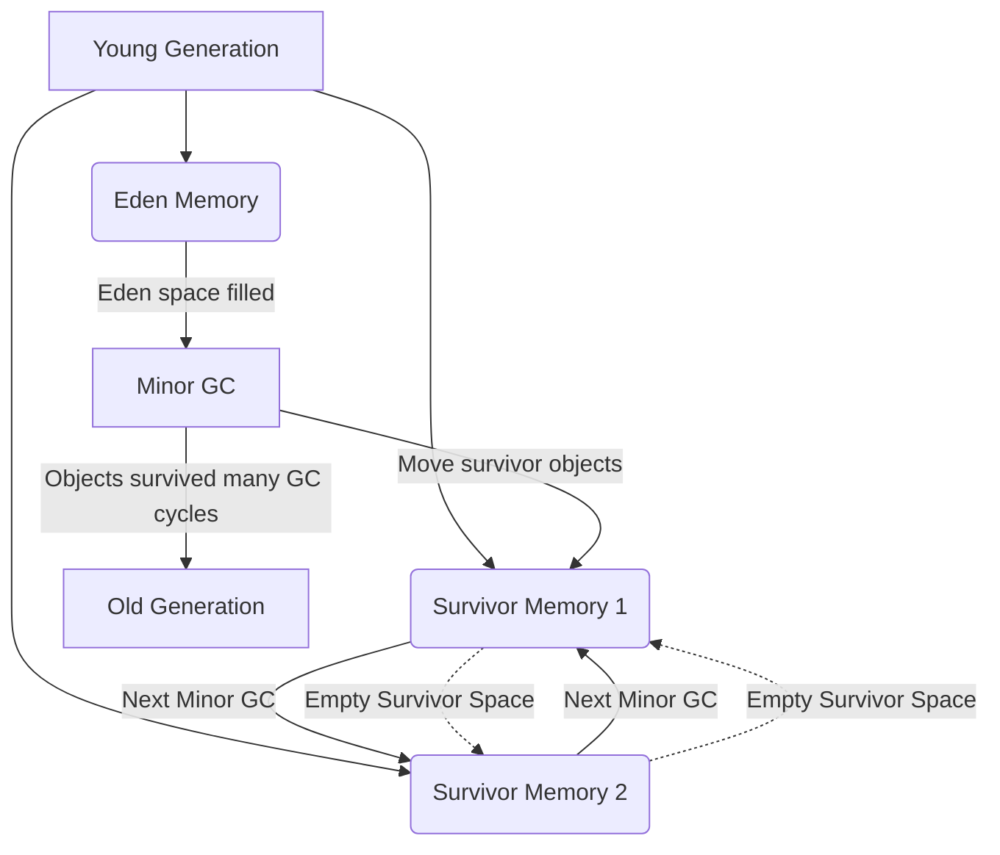

#creation_date:  2024-08-11 00:28
#modification_date: Sunday 11th August 2024 00:28:58
> [!quote] True friendship ought never to conceal what it thinks.
> — Jerome
#### JMM (Java Memory Model)
- **Overview**: Describes how threads in the Java programming language interact through memory and what behaviors are allowed in concurrent execution.
- **Memory Types**:
  - **Heap Memory**:
    - Stores objects and class instances.
    - Shared among all threads.
  - **Stack Memory**:
    - Stores local variables, method call details, and partial results.
    - Each thread has its own stack.
  - **Metaspace** (from Java 8):
    - Stores class metadata.
    - Replaces PermGen space.
  - **PC Registers**:
    - Each thread has its own program counter (PC) register.
    - Points to the next instruction to be executed.
  - **Native Method Stacks**:
    - Used for native method invocations.

![[Pasted image 20240811112154.png|700]]

## Young Generation

- **Young Generation**: This is the memory area where all the new objects are created.
- **Eden Memory**: Most newly created objects start in the Eden space. When it's full, a Minor GC is triggered.
- **Survivor Spaces**: There are two survivor spaces. After Minor GC, survivor objects are moved between these two spaces.
    - **Empty Survivor Space**: At any given time, one of the survivor spaces is empty, as objects are moved between them.
- **Minor GC**: This is the garbage collection process that occurs when the Eden space is filled.
- **Old Generation**: Objects that survive several cycles of Minor GC are moved to the old generation memory space. This usually happens after the objects reach a certain age threshold in the young generation.
