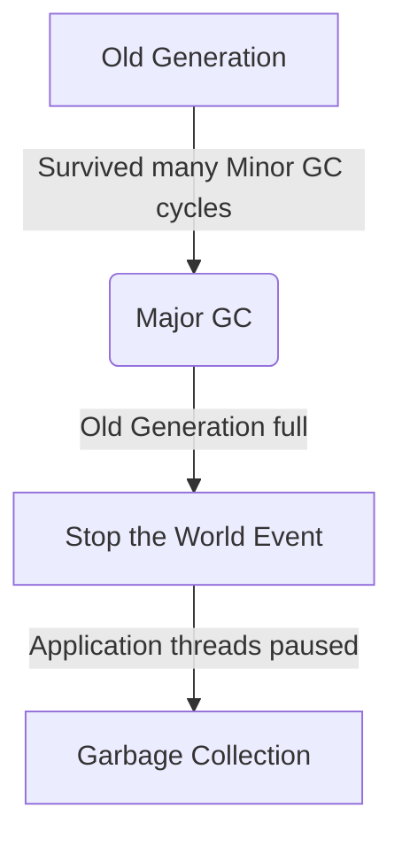
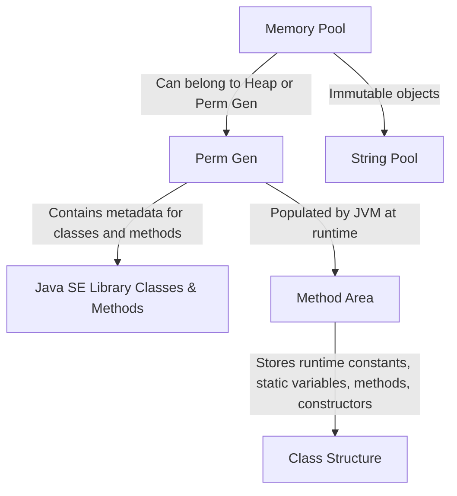

#creation_date:  2024-08-11 11:58
#modification_date: Sunday 11th August 2024 11:58:40
> [!quote] The only limit to our realization of tomorrow will be our doubts of today.
> — Franklin D. Roosevelt

- **Old Generation**: Contains long-lived objects that survived many rounds of Minor GC. Garbage collection in this area is called **Major GC**, which is slower and can cause application pauses.
- **Stop the World Event**: During any GC (Minor or Major), application threads are paused. This is more noticeable during Major GC, which can make applications unresponsive if not properly managed.

- **Perm Gen**: Stores metadata required by the JVM to describe classes and methods. It's not part of the Java Heap memory and is populated by the JVM at runtime.
- **Method Area**: A part of Perm Gen, it stores class structures, runtime constants, static variables, and code for methods and constructors.
- **Memory Pool**: Created by JVM memory managers, Memory Pools can hold immutable objects, like the **String Pool**. Depending on the JVM implementation, a Memory Pool can belong to either the Heap or Perm Gen.