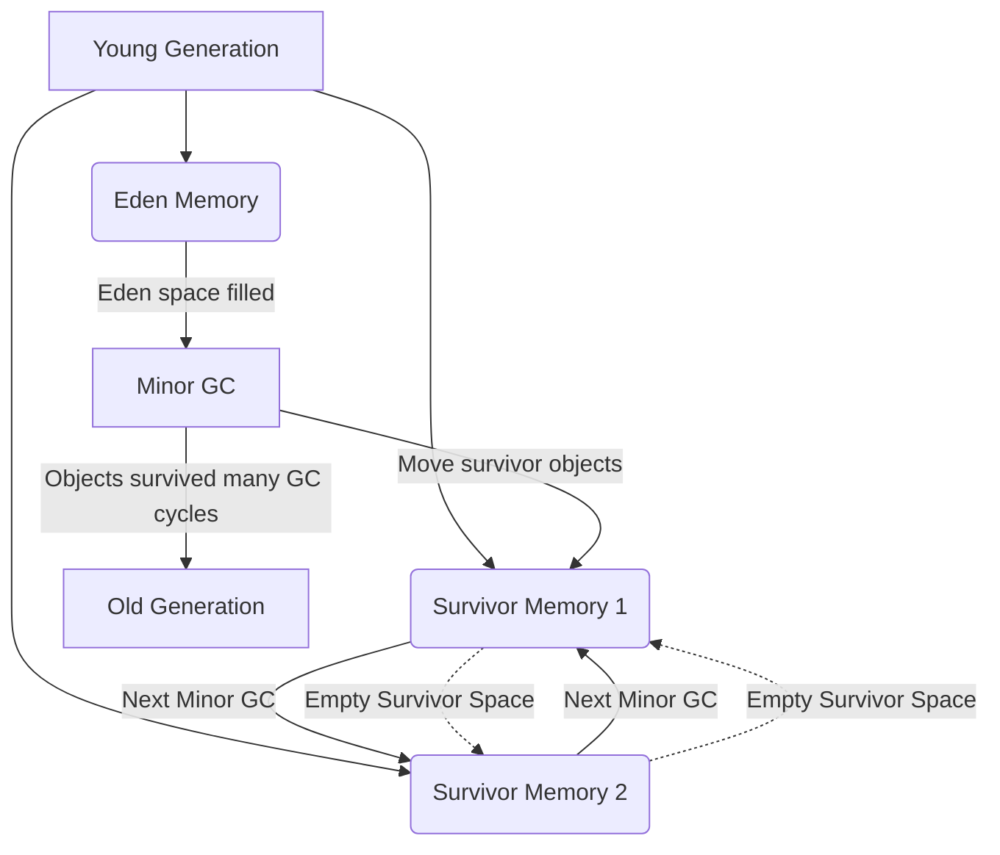

#creation_date:  2024-08-11 12:03
#modification_date: Sunday 11th August 2024 12:03:43
> [!quote] There is a wisdom of the head, and a wisdom of the heart.
> — Charles Dickens

## Young Generation
#young_gen, #GC 

- **Young Generation**: This is the memory area where all the new objects are created.
- **Eden Memory**: Most newly created objects start in the Eden space. When it's full, a Minor GC is triggered.
- **Survivor Spaces**: There are two survivor spaces. After Minor GC, survivor objects are moved between these two spaces.
    - **Empty Survivor Space**: At any given time, one of the survivor spaces is empty, as objects are moved between them.
- **Minor GC**: This is the garbage collection process that occurs when the Eden space is filled.
- **[[Old Generation]]**: Objects that survive several cycles of Minor GC are moved to the old generation memory space. This usually happens after the objects reach a certain age threshold in the young generation.